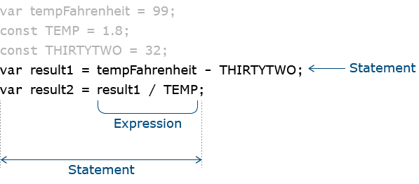
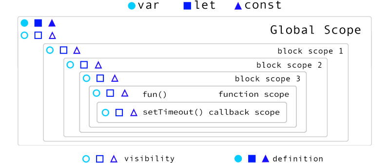
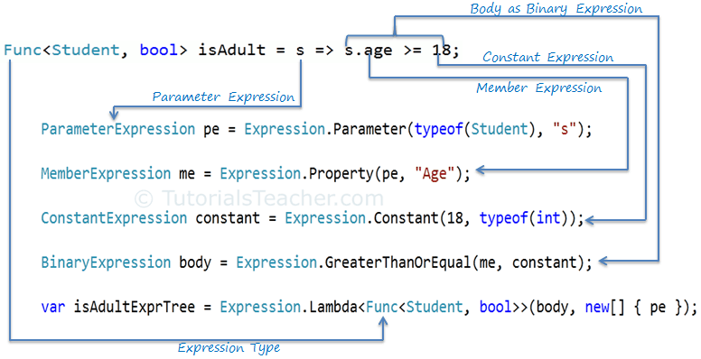

# Summary

Nowadays, the production of data based on mobile devices, IoT and
computers have reached an enormous scale and complexity, at the same
time the importance of quickly accessing the stored data is increasing
day by day, nevertheless querying data on the web still requires too
much work. The use of well-known libraries, such as `GraphQL` and
`OData` is widespread. Yet, developers are supposed to code custom
functions such as resolvers or specialized actions while using these
tools. In this article, we will give details about our libraries to
solve these kinds of problems, the approaches we have followed, the
issues we encountered and our solutions. The main topics will be how to
interpret the code written in JavaScript and C\# only, the Lazy Loading
approach with the Generators that comes with EcmaScript 6, and the
method of dynamically creating `IQueryable` in C\#.

# Statement of need

Many functional programming languages and C\# has an integrated data
query system that adopts declarative approach for the data access. While
we were developing our solution, we were inspired by LINQ (Language
Integrated Query) published in C\# 3.0. We set the LINQ query interface
as our goal, which includes the most comprehensive data query approach,
and developed a 100% compatible version for the Web. We use the same
LINQ syntax as described in the official documentation, while
implementing the functionality for our solution . Our approach is based
on the idea of the Lazy Loading feature with Generators. The standart
LINQ approach for the conditional sum is as follows :

```csharp
int[] numbers  = {1, 2, 2, 3, 4, 4, 5, 5};
var sumResult = numbers.Where(n => n <= 3).Sum();
Console.WriteLine("The sum is {0}", sumResult);
```

The standart C\# approach for the same conditional sum is as follows :

```csharp
int[] numbers  = {1, 2, 2, 3, 4, 4, 5, 5};
int sumResult = 0;
foreach(int n in numbers)
        if (n <= 3)
            sumResult += n;
Console.WriteLine("The sum is {0}", sumResult);
```

As seen in previous examples, the LINQ based approach has the advantage
of reducing the number of statements required to implement the same
function. This advantage is achieved by way of using a lambda expression
in a single expression statement, which makes the code more readable and
maintainable. This is one of the main reasons to use LINQ for the
development of a functional programming library. To demonstrate the
benefits of using a lambda expression approach for the implementation of
a data querying task, we are going to see the following example :

```csharp
var someNumbers = { 4, 3, 2, 1 };

var processed = someNumbers
    .Select(n => n * 2)   // Multiply each number by 2
    .Where(n => n != 6)   // Keep all the results, except for 6
    .OrderBy(n => n);     // Sort in ascending order
```

The first step in our implementation is to create a common interface to
query data independently of the data source. This interface will be
called as “Query” and is derived from the standard LINQ interface. We
create our immutable query objects using the Fluent Interface template
with a method linking approach and a simple helper class which will be
used to execute the query method. The query process is not run until the
result is requested (Lazy Execution) by calling the execute() method on
the provider.

The programming language of the web is still JavaScript, which is
supported by the current version of major web browsers such as Google
Chrome, Firefox, Safari and Internet Explorer. Although the syntax has
evolved over time, many of the syntax conventions remain similar to
older versions. Alternatives such as WebAssembly needs time to be
accepted and standardized by the community, which can take many years.
While working with JavaScript, mistakes made at the development phase
could be challenging to identify and might cause runtime error because
of the lack of a type system, which is a prerequisite for the web. While
we were developing all our libraries, we preferred the TypeScript
superset language to be able to safely develop scalable JavaScript
applications without having to worry about the type system and other
aspects of the programming language. With this approach, we can generate
JavaScript codes which will work on different platforms and browsers
without having to change; also, this method does not contain simple
conversion errors.

Thanks to the structure we have created, queries can be run for arrays
on the browser, furthermore for any data source (such as a database) on
the server, while the server itself only needs to perform a single
query. There is no need for the database engine to know where the data
comes from. With the auxiliary projects we have developed in addition to
our query library, we can serialize the query operations on the
client-side and send them to the server without having to modify the
code. On the server-side, we can automatically convert our query format
to LINQ format and query any data source that supports LINQ as a query
language. This flexible structure we have created gives software
developers the power to develop their solutions for different data
targets.

The rest of the paper is organized as follows: Section [sec:projects]
briefly introduces the related projects. Section [sec:jingu] shows our
proposed and implemented library. Section [experiments] shows our
experimental setup and results. Section [conclusion] concludes this
paper.

## Projects

While creating the query platform on the Web with JavaScript, we
developed the following modules (Sanirim bu cumle eksik kalmis). Through
developing our family of libraries, we adopted highly acclaimed Micro
Service approach and created separate modules for solution domains. Here
are the main modules:

- **Jokenizer**: JavaScript expression parser/evaluator

- **Jokenizer .Net**: C\# expression parser/evaluator.

- **DynamicQueryable**: C\# dynamic query generator.

- **Jinqu**: JavaScript querying framework

### Jokenizer

Jokenizer is a library to simplify the implementation of ... Files
created while developing in a programming language contain code
statements, and statements consist of expressions.



Since we will be limited to expression support in our query engine;
instead of working with extensive JavaScript interpreters, we developed
our own expression tree parser (Syntax Tree Parser). This library was
initially available to many Java developers and was ported to other
languages, like C\#, Ruby, and Python. We created an expression tree
with a Scanner that performs Lexical Analysis and Syntax Analysis
operations.

```javascript
const lambda = tokenize('(a, b) => a < b')

{
    "type": "Func",
    "parameters": ["a", "b"],
    "body": {
        "type": "Binary",
        "operator": "<",
        "left": {
            "type": "Variable",
            "name": "a"     
        }   
        "right": {
            "type": "Variable",
            "name": "b"     
        }   
    }
}
```

#### Operator Precedence

When interpreting expressions written in a programming language, it is
essential to pay attention to operator precedence. If priority
adjustment is not made for consecutive operations, might calculate
incorrect results. An example of operator precedence is:

```csharp
4 + 2 * 5 - 1
```

If the operations are combined with the encounter order while creating
the expression tree, a result like the following is obtained.

```csharp
(((4 + 2) * 5) - 1) // 29
```

If the operator precedence is fixed, we get the following expression,
considering that multiplication has a higher priority than addition
while interpreting the code.

```csharp
(4 + (2 * 5) - 1) // 13
```

#### Evaluating Expression Tree

We developed our own expression interpreter to run prebuilt expression
trees. Since JavaScript scopes are closed to developer access, we
allowed to pass scope as parameter during code evaluation. Figure
below illustrates the following syntax.



The interpreter can access the variables using the given scopes (sent as
arguments). Let’s consider the following code:

```javascript
// compare expression
// second parameter will be used as scope to get "v1" and "v2" values
const value = evaluate('v1 < v2', { v1: 5, v2: 3 });
console.log(value);             // false

// parsing a function
const func = evaluate('function(a, b) { return a < b; }')
console.log(func(5, 3));        // false

// parsing a lambda
const lambda = evaluate('(a, b) => a < b');
console.log(lambda(5, 3));      // false
```

### Jokenizer .Net

Following the same logic as the jokenizer project that we developed for
JavaScript, we created an interpreter for the C\# programming language.
This code is a simple example to understand:

```javascript
var expression = Tokenizer.Parse<ObjectToken>("new {a = 4, b.c}") 
```

#### Token Tree

Since Expression is a language-integrated type in C\# language and is
designed to work without the need to take the scope information
parameter, we had to create our own intermediate type to be able to
support external scopes.



Instead of the expression tree that we get when interpreting codes for
JavaScript, we create a token tree. We can create a C\# expression tree
by passing the scope information as a parameter to the token tree.

#### TokenVisitor Class

Our `TokenVisitor` class allows us to interpret the codes with the scope
argument by navigating the symbols we create in a recursive manner.

```javascript
new TokenVisitor(variables, parameters).Process(token, typeParameters)

var token = Tokenizer.Parse<BinaryToken>("@0 > 42");
// @0 will be interpreted as an external parameter
var lambda = Evaluator.ToFunc<bool>(token, 40);
var result = lambda();      // False
```

We do not have to create the token tree to evaluate code, we can
directly create a function as follows.

```javascript
var lambda = Evaluator.ToLambda<int, bool>("@2 > 42", 40)
var result = lambda(); // false
```

#### Dynamic Classes

Since C\# is a type safe language, we need to dynamically create the
classes we need at run-time and declare them to the type system.

```javascript
// first type contains "a" and "c" properties
// assume (b.c is int)
Tokenizer.Parse<ObjectToken>("new { a = 4, b.c }");

// again we are creating a type with "a" and "b" properties
Tokenizer.Parse<ObjectToken>("new { a = 4, c = 5 }");
```

With the examples above, the class with the signature below is
dynamically created (only one class is created for both, because they
have the same typed properties).

```csharp
public class DynamicClass1 {
    public int a { get; set; }
    public int b { get; set; }
}
```

#### DynamicQueryable

After completing our module development that can interpret the
expressions with C\# language, we now need to be able to create dynamic
LINQ queries.

All the functionality used in the LINQ infrastructure is provided by the
extension methods defined for the `IQueryable` interface.

```csharp
public static IQueryable<TResult> Select<TSource, TResult>(this IQueryable source, Expression<Func<TSource, TResult>> selector) {
    return source.Provider.CreateQuery<TResult>(
        Expression.Call(
            null,
            GetMethodInfo(Queryable.Select, source, selector),
            new Expression[] { source.Expression, Expression.Quote(selector) }
        )
    );
}
```

The structure we need to develop at this stage should enable us to do
very similar to this call with string values. Our method signature
should look like the following:

```csharp
public static IQueryable Select(this IQueryable source, string selector)
```

The signatures of all our methods are very similar, we will convert the
incoming string parameter to a `LambdaExpression` with the help of
Jokenizer .Net. Our independent modules will use other modules that they
need with package references.

We can divide the methods we can call with LINQ into two main
categories, query returners (`Where, OrderBy, Select` etc.) and value
returners (First, Min, Any etc.). `DynamicQueryable.cs` class will
contain all the helpers.

The expression trees we have created (thanks to the Jokenizer .Net
project) make it very easy to create dynamic queries, it is enough to
call just one ready-made C\# method.

```csharp
// with the help of helper methods, query construction is only one line
// there are many other overloaded methods
public static IQueryable Where(IQueryable source, string predicate, 
    IDictionary<string, object> variables, params object[] values) {
    return HandleLambda(source, "Where", false, variables, values);
}

// generic parameter is true for "Select"
public static IQueryable Select(IQueryable source, string predicate, 
    IDictionary<string, object> variables, params object[] values) {
    return HandleLambda(source, "Select", true, variables, values);
}
```

The use of our library methods by software developers is as follows:

```csharp
IQueryable<Order> query = GetOrders();
// we can use ordered parameters
var dynOrders1 = query.Where("o => o.Id > @0", 40)
    .ToList();
// or we can pass a named parameter
var dynOrders2 = query.Where(
    "o => o.Id > @0",
    new Dictionary<string, object>{ { "AvgId", 40 } }
).ToList();
// works with non-generic queries too
IQueryable baseQuery = query;
var dynOrders3 = baseQuery.Where("Id > @0", 40)
    .Cast<Order>().ToList();
```

### Jinqu

With the projects we have covered in the previous headings, we have
become able to interpret the expressions written in JavaScript and C\#.
With C\#, we can reflect these expressions on IQueryable and create our
queries dynamically. At this stage, we created Jinqu project, the LINQ
structure for JavaScript. We will first focus on the developments that
allow us to run queries on arrays.

#### IQueryProvider

We provide our query execution process with the `IQueryProvider`
interface as in the C\# LINQ structure we were inspired.

```typescript
    export interface IQueryProvider {
        createQuery(parts?: IQueryPart[]): IQueryBase;
        execute<TResult = any[]>(
            parts: IQueryPart[]
        ): TResult;
        executeAsync<TResult = any[]>(
            parts: IQueryPart[]
        ): PromiseLike<TResult>;
    }
```

It allows us to query the data source (that the queries are written
independently of). Query providers can be used to execute given query
for JavaScript array as well as a database, or a Web Service. Custom
implementations are possible for other data sources.

#### IQueryPart

We store every query operation made on the data source with the
QueryPart type. This type includes what kind of call is made (such as
filtering, sorting), the list of expression trees (where more than one
parameter can be found) and its variable scopes.

```typescript
export interface IQueryPart {
    readonly type: string;
    readonly args: IPartArgument[];
    readonly scopes: any[];
}
```

Below is an example of a query with filtering and sorting.

```typescript
    query.Where(c => c.Id > 5).OrderBy(c => c.Name);
```

The call we see in the example is stored by the Jinqu in a data
structure such as follows.

### Query Types

Our most basic interface representing the query class is called
IQueryBase.

```typescript
    export interface IQueryBase{
        readonly provider: IQueryProvider;
        readonly parts: IQueryPart[];
    }
```

This type holds the data source and uses query method information (like
filter, orderBy etc..) on the query. We can also call these query
methods directly from JavaScript arrays. However, since some methods are
predefined for JavaScript arrays, we designed the query methods so that
they can be called with different names over the arrays.

```typescript
interface IQueryDuplicates<T, TExtra = {}> {
    concat(other: T[]): IQuery<T, TExtra>;
    join<TOther, TResult, TKey>(/* ... */)
        : IQuery<TResult, TExtra>;
    reverse(): IQuery<T, TExtra>;
}
```

We have collected all other methods (not overlapping methods) under a
type named `IQuerySafe`.

```typescript
export interface IQuerySafe<T, TExtra = {}> 
    extends IQueryBase, Iterable<T> {
    // ...
    orderBy(keySelector: Func1<T>, ...scopes: any[])
        : IOrderedQuery<T, TExtra>;
    select<TResult = any>(
        selector: Func1<T, TResult>, ...scopes: any[]
    ): IQuery<TResult, TExtra>;
    where(predicate: Predicate<T>, ...scopes: any[])
        : IQuery<T, TExtra>;
    toArray(ctor?: Ctor<T>): Result<T[], TExtra>;
}
```

We can define the query type as a combination of two different types
that we created.

```typescript
    export type IQuery<T> = IQuerySafe<T> & IQueryDuplicate<T>;
```

Collecting methods that conflict with JavaScript and safe methods under
separate types will give us an advantage when defining array expansion
with TypeScript.

A real query class that we created using the type definitions we have
made looks like the following.

```typescript
    export class Query<T = any> 
        implements IOrderedQuery<T, TExtra>, Iterable<T>
    {
        
        constructor(
            public readonly provider: IQueryProvider,
            public readonly parts?: IQueryPart[]) {
        }
        /* ... */
    }
```

### Iterable\<T\>

Our queries are created by method chaining mechanism and no action is
taken on the data (lazy execution) until the results are requested.
During the query operation, only the required number of elements are
processed by using Iterator Pattern.

When we perform a search and limit operation on a list containing 10,000
records, traditional methods run a filter operation on all elements and
return as many elements as necessary.

```typescript
    const list = getItems()
        .filter(complexPredicate)
        .slice(0, 3);
```

Let’s assume that the first 3 records on our list meet the required
conditions. With the Iterator approach, the algorithm works as follows.

```typescript
    const list = getItems()
        .where(complexPredicate)
        .take(3);
```

- **Where** will **yield** first object
- **Take** will take this object and reduce required count by one
- **Where** will **yield** second object
- **Take** will take this object and reduce required count by one
- **Where** will yield **third** object
- **Take** will take this object and since required count is reached,
    will stop the execution
- 3 objects will be returned as result

As you can see, the approach we have developed can return the desired
results without spending unnecessary processing power.

Although we try to avoid complex code examples, we would like to briefly
show you how the query class makes its methods available.

```typescript
    // a synchronous method example
    // method call is added to the parts array
    // and executed by the provider
    public any(predicate?: Predicate<T>, ...scopes)
    : Result<boolean, TExtra> {
        return this.provider.execute([
            ...this.parts,
            QueryPart.any(predicate, scopes)
        ]);
    }

    // async version of the any method
    // provider executes asynchronously
    public anyAsync(predicate?: Predicate<T>, ...scopes)
    : PromiseLike<Result<boolean, TExtra>> {
        return this.provider.executeAsync([
            ...this.parts,
            QueryPart.any(predicate, scopes)
        ]);
    }

    // method chaining example
    // "where" call will be added to the part list
    public where(predicate: Predicate<T>, ...scopes)
    : IQuery<T, TExtra> {
        return this.create(
            QueryPart.where(predicate, scopes)
        );
    }

    // create helper method
    // every call on the query will result with a new query
    protected create<TResult, TNewExtra>(part: IQueryPart)
    : IQuery<TResult, TNewExtra> {
        return this.provider.createQuery([
            ...this.parts,
            part
        ]) as any;
    }
```

The query class implements the Iterator approach with the Symbol
property made available with the EcmaScript 6 standard as follows.

```javascript
[Symbol.iterator ](){
    return  this.provider.execute <IterableIterator <T>>(this.parts);
}
```

#### Expanding the JavaScript Array Type

In order to use our query system directly on JavaScript arrays, we first
need to make our TypeScript type definitions and link our methods to the
JavaScript array type using Declaration Merging.

```typescript
declare global {
    interface Array<T> extends IQuerySafe<T> {
        q(ctor?: Ctor<T>): IQuery<T>;
        joinWith<TOther, TResult = any, TKey = any>(
            other: TOther[],
            thisKey: Func1<T, TKey>,
            otherKey: Func1<TOther, TKey>,
            selector: Func2<T, TOther, TResult>,
            ...scopes
        ): IQuery<TResult>;
        concatWith(other: T[]): IQuery<T>;
        reverseTo(): IQuery<T>;
    }
}
```

We previously split our query type to two parts (IQuerySafe and
IQueryDuplicate). We only expand array with safe interface, for
overlapping methods we add custom methods with minor changes to the
naming (like `joinWith` instead of `join`).

This change allowed us to convince the TypeScript runtime that query
methods reside on arrays.

We use the prototype extension approach to make actual method bindings
to the JavaScript array class.

```typescript
function extendArray(func: string) {
    let f = func;
    if (func === "join" || func === "concat") {
        f += "With";
    } else if (func === "reverse") {
        f += "To";
    }

    Array.prototype[f] = Array.prototype[f] || function() {
        const q = this.asQueryable();
        return q[func].apply(q, arguments);
    };
}
```


### Array Query Provider

In order to run the written query objects, we need to implement query
provider classes. We defined the query provider for arrays in our
project.

```typescript
export class ArrayQueryProvider implements IQueryProvider {

    constructor(private readonly items: any[] | IterableIterator<any>) {
        if (!items) {
            throw new TypeError("Cannot query null array.");
        }
    }

    public createQuery<T>(parts?: IQueryPart[], ctor?: Ctor<T>): Query<T> {
        const query = new Query<T>(this, parts);
        return ctor ? (query.cast(ctor) as any) : query;
    }

    public execute<TResult = any>(parts: IQueryPart[]): TResult {
        // ...
    }

    public executeAsync<TResult = any>(parts: IQueryPart[]): PromiseLike<TResult> {
        return new Promise((resolve, reject) => {
            try {
                resolve(this.execute(parts));
            } catch (e) {
                reject(e);
            }
        });
    }
    // ...
}
```

Although we try to avoid technical details, we wanted to give an example
of running a query for an array with a small piece of code.

```typescript
*where(items: IterableIterator<any>, 
        predicate: IPartArgument) {
    for (const i of items) {
        if (predicate.func(i)) {
            yield i;
        }
    }
}
```

With the help of Generators (denoted by \*), which comes with EcmaScript
6, we are applying the Iterator approach. In the filtering process, each
record suitable for the constraint expression is selected (yield). Since
other methods calling this method can stop the selection process at any
time, it is not necessary to check all records.

#### Supported Methods

With Jinqu, we applied all the methods in the LINQ framework. Our entire
list is as follows: where, ofType, cast, select, selectMany, join,
groupJoin, orderBy, orderByDescending, thenBy, thenByDescending, take,
takeWhile, skip, skipWhile, groupBy, distinct, concat, zip, union,
intersect, except, defaultIfEmpty, reverse, first, firstOrDefault, last,
lastOrDefault, single, singleOrDefault, elementAt, elementAtOrDefault,
contains, sequenceEqual, any, all, count, min, max, sum, average,
aggregate.

## Conclusion

We can see the usage of our completed project in the code snippet below.

```typescript
const array = [1, 2, 3, 4, 5]
const query = array
    .where(c => c%2 === 0)
    .orderByDescending(n => n)
    .toArray()
for (const n in query) {
    console.log(n)  // outputs 4,2
}
```

Our querying platform empowers developers to create custom solutions for
different requirements. Web query library linquest and OData client
jinqu-odata are just two examples, and they’re used by many companies
globally. OData organization accepted jinqu-odata as an official library
and listed in their site (under the JavaScript tab).

As future works, we are planning to develop following properties
(libraries, functions, methods etc.)

An online sample of the usage of our jinqu-odata project is prepared by
Ben Albahari and can be accessed at https://stackblitz.com/edit/jinqu.
